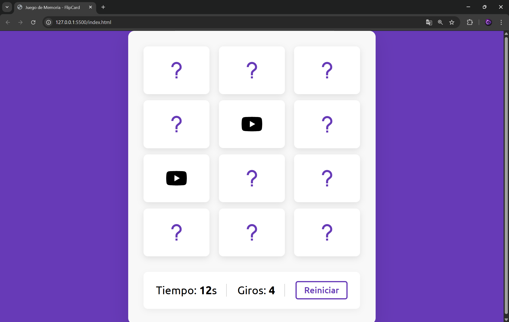

🎴 Memory FlipCard Game

¡Bienvenido a Memory FlipCard Game!
Un juego clásico de memoria desarrollado con tecnologías web básicas. Tu objetivo es encontrar todas las parejas de cartas antes de que el tiempo se agote.

🚀 Características
🔢 Sistema de puntuación: Contador de movimientos (flips) en tiempo real.
⏱️ Temporizador: Dispones de 20 segundos para completar el juego.
🔀 Barajado aleatorio: Las cartas cambian de posición en cada partida.
📱 Diseño responsivo: Compatible con dispositivos móviles y escritorio.
🎨 Animaciones suaves: Efectos 3D al voltear cartas y animación de error (shake).
🛠️ Tecnologías Utilizadas
HTML5 – Estructura del juego
CSS3 – Estilos, animaciones y diseño responsivo
JavaScript (ES6) – Lógica del juego y manipulación del DOM
Boxicons – Iconos de redes sociales
📂 Estructura del Proyecto
├── index.html   # Estructura principal del juego
├── style.css    # Estilos, animaciones y diseño responsive
├── script.js    # Lógica del juego y temporizador
└── README.md    # Documentación
🎮 Cómo Jugar
Abre el archivo index.html en tu navegador.
Haz clic en una carta para voltearla.
Selecciona una segunda carta:
✅ Si coinciden → permanecen visibles.
❌ Si no coinciden → se ocultan nuevamente.
Encuentra todas las parejas antes de que el tiempo llegue a 0.
Usa el botón Reiniciar para comenzar una nueva partida.
🔧 Instalación y Uso

No necesitas instalar dependencias ni usar servidores.

git clone https://github.com/tu-usuario/memory-flipcard-game.git
cd memory-flipcard-game

Luego abre index.html en tu navegador.

📝 Notas de Desarrollo

Este proyecto fue creado con fines educativos para practicar:

Manipulación del DOM en JavaScript
Uso de setInterval y setTimeout
Lógica de comparación de cartas
Animaciones con CSS (perspective, transform, backface-visibility)
📸 Demo

Agrega aquí una captura de pantalla del juego:

❤️ Autor

Desarrollado por Luis Orlando